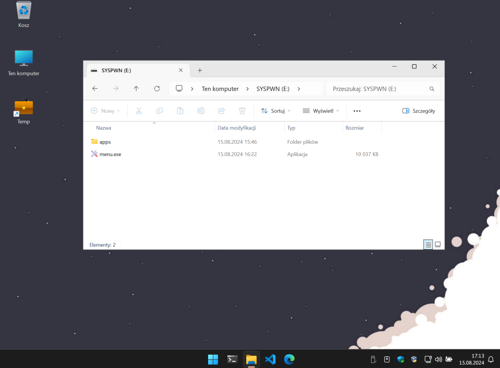
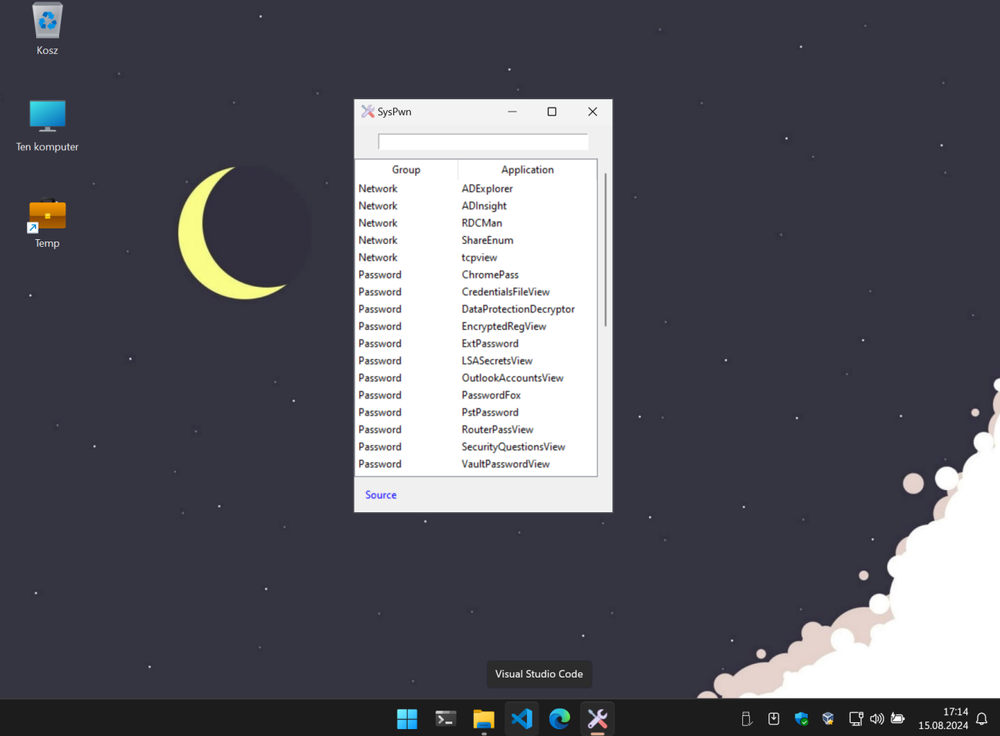
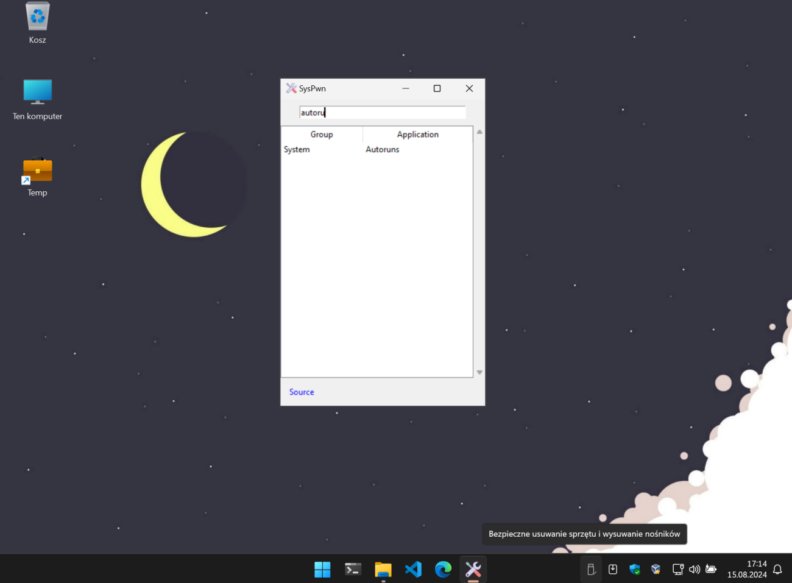
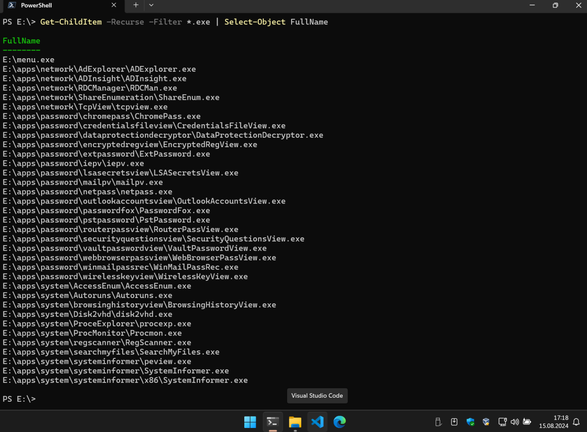

## SysPwn

**SysPwn** is a simple application manager built in Python using Tkinter. This tool scans a specified directory for `.exe` files, grouping them based on the directory structure, and allows easy launching of these applications via a graphical user interface (GUI).

I created this application launcher for my needs. It allows me to run applications straight from a USB stick. My version of the flash drive has applications from [SysinternalsSuite](https://learn.microsoft.com/en-us/sysinternals/) and [Nirsoft](https://www.nirsoft.net/). Some of these applications are detected as malicious and removed by antiviruses, so I use a write-blocking USB stick [Kanguru FlashBlu30™ Lightning-Fast USB3.0 with Physical Write Protect Switch](https://www.kanguru.com/products/kanguru-flashblu30-usb3-flash-drive), I use this one but you can choose any manufacturer. Thanks to write-prevention, your toolkit will not be deleted or corrupted every time you insert the usb into the computer, so you can add exclusion to your AV and work with your favourite applications with peace of mind.

Simply copy the menu.exe file on the memory stick, create a `/apps/` directory in it, create folders which will be regarded as categories e.g. network_tools, system_tools, password_recovery and in them create separate folders for each application. For example, the `Autoruns.exe` application from Sysinternals will be in `/apps/system/autoruns/Autoruns.exe`. After launching menu.exe, the program will read the structure of the /apps/ directory and add entries in the menu, the system directory will be the name of the category (use only underscores, no spaces or other hyphens) and the exe file name will be the name of the app in the menu.

### Screenshots

|  |  |
| ------------------------------------------------ | -------------------------------------------------------- |
|  |  |

### Features

- **Dynamic Application Scanning:** Automatically scans the `apps` directory and displays available `.exe` applications in the user interface.
- **Application Filtering:** Allows searching for applications based on their names and groups.
- **Easy Application Launching:** Launch selected applications with a double-click.
- **Local PowerShell shortcut:** Launch local PowerShell in `/apps/` folder.
- **Specific exe file exclusion:** `Using exclude.cfg` file you can exclude specific exe file from Dynamic Application Scanning.

### Requirements

- Python 3.x
- Tkinter (included with most Python distributions)
- PyInstaller (optional, if you want to generate a `.exe` file)

### Installation

1. Clone the repository:
   ```bash
   git clone https://github.com/h0ek/SysPwn.git

2. Run script
   ```bash
   python menu.py
   
### Download compiled

Go to [Releases](https://github.com/h0ek/SysPwn/releases) page and download latest build.

### Compile yourself

1. Clone the repository:
   ```bash
   git clone https://github.com/h0ek/SysPwn.git

2. Install the requirements
   ```bash
   pip install pyinstaller
   
3. Build exe
   ```bash
   pyinstaller --onefile --windowed --add-data "tools.ico:." --icon=tools.ico --version-file=version.txt menu.py

## License

This project is licensed under the MIT License. See the [LICENSE](https://github.com/h0ek/SysPwn/blob/main/LICENSE) file for more details.

## ToDo

- [x] ~~Run system PowerShell console in the `/apps/` folder~~
- [x] ~~Add separate config file where user can exclude specific exe files~~
